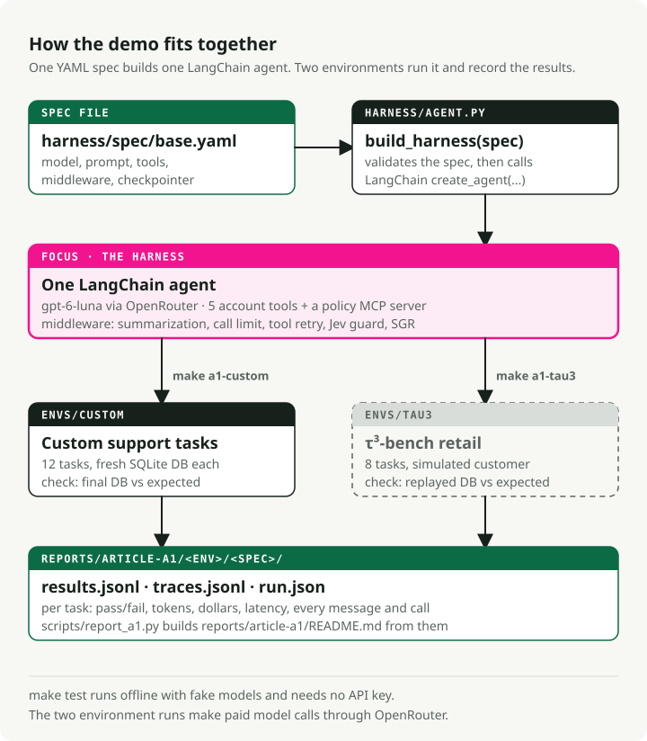
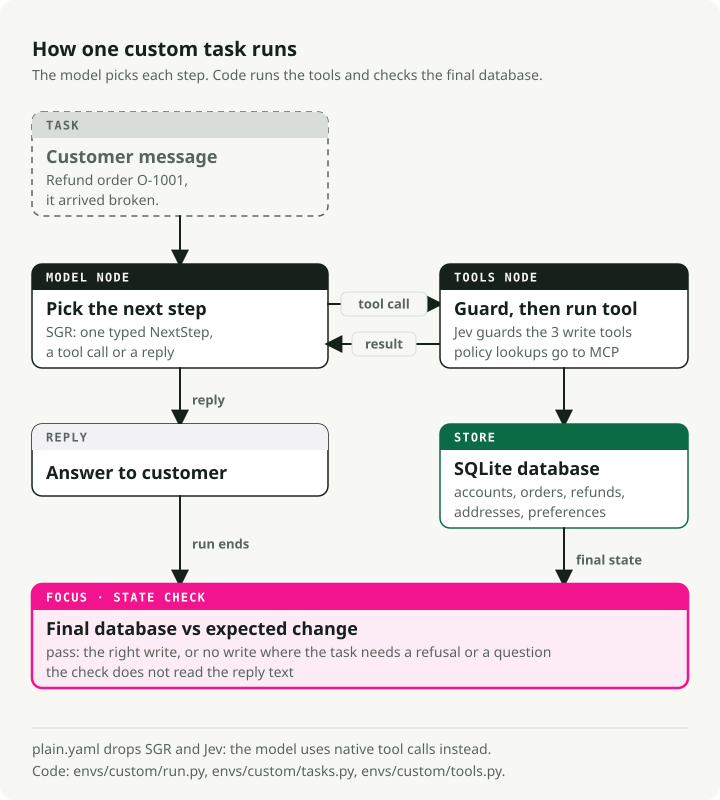

# agent-harness-lab

A small, runnable agent harness for a customer-support assistant, built on LangChain.

This is the demo for the article
[Designing an agent harness: from task to architecture](https://slavadubrov.com/blog/2026/09/28/first-langchain-agent-harness/),
Part 1 of the series **Building and Evaluating Agent Harnesses**.

The assistant handles refunds, address changes and account preferences. One YAML file
defines the whole harness: model, prompt, tools and middleware. Two task environments
run it and check the final database.

<picture>
  <source media="(prefers-color-scheme: dark)" srcset="docs/img/overview.dark.svg">
  
</picture>

## What is inside

| Folder | What it holds |
|---|---|
| [`harness/`](harness/) | `build_harness(spec)`, the spec schema, the SGR and Jev middleware, token and cost accounting |
| [`harness/spec/`](harness/spec/) | The spec files: `base.yaml` and the variants that extend it |
| [`envs/custom/`](envs/custom/) | 12 support tasks, a SQLite database, 5 account tools and a policy MCP server |
| [`envs/tau3/`](envs/tau3/) | Adapter that runs the same harness on 8 τ³-bench retail tasks |
| [`reports/article-a1/`](reports/article-a1/) | Saved results, traces and package versions |
| [`tests/`](tests/) | Offline tests with fake models |

## How one task runs

<picture>
  <source media="(prefers-color-scheme: dark)" srcset="docs/img/one-task.dark.svg">
  
</picture>

- The model chooses every step. There is no fixed pipeline.
- The tools check only that the data exists and the refund amount fits. The agent must
  check ownership and policy itself, so a run can expose a write the policy forbids.
- A task passes when the final database matches the expected change. Seven of the
  twelve tasks expect no change: the agent must refuse or ask a question.

## The two main specs

| Spec | What it contains |
|---|---|
| [`plain.yaml`](harness/spec/plain.yaml) | Native tool calling, summarization, a limit of 20 model calls per run, 2 retries on a tool error |
| [`base.yaml`](harness/spec/base.yaml) | Everything in `plain`, plus Schema-Guided Reasoning (SGR) and a Jev guard on the three write tools |

`glm-5.3-flash.yaml` and `mimo-v2.6-flash.yaml` are `base.yaml` with another model.

## Run it

You need [uv](https://docs.astral.sh/uv/). The environment runs also need an
[OpenRouter](https://openrouter.ai) API key and make paid model calls.

```bash
git clone https://github.com/slavadubrov/agent-harness-lab-public
cd agent-harness-lab-public
cp .env.example .env                        # set OPENROUTER_API_KEY
make test                                   # offline, no key needed
make a1-custom SPEC=harness/spec/plain.yaml # 12 custom tasks
make a1-tau3   SPEC=harness/spec/plain.yaml # 8 τ³-bench retail tasks
```

Without `SPEC`, both targets use `base.yaml`. Each run prints one line per task and
replaces the files under `reports/article-a1/<env>/<spec>/`. Use `git diff` to compare
your run with the saved one. `make help` lists every target.

## Results

[`reports/article-a1/NOTES.md`](reports/article-a1/NOTES.md) summarizes the saved runs.
[`reports/article-a1/README.md`](reports/article-a1/README.md) has the per-task tables.
Each row is a single run per task, so small differences between rows are not measured
effects.

The article quotes the runs saved at tag
[`v0.1.1-a1`](https://github.com/slavadubrov/agent-harness-lab-public/tree/v0.1.1-a1/reports/article-a1).

## More detail

| Document | Read it to learn |
|---|---|
| [How the harness works](docs/how-it-works.md) | How a spec becomes an agent, where each middleware runs, what SGR and Jev do, what is recorded |
| [The environments](docs/environments.md) | The 12 custom tasks and their checks, and how the τ³-bench adapter works |
| [Writing a spec](docs/specs.md) | The spec format, `extends:`, tool sources, custom middleware and workflow specs |

## What this demo leaves out on purpose

- The tools do not enforce ownership or business policy. A real service would reject
  a write that breaks policy.
- There is no limit on total time or spending per task, and retried writes have no
  idempotency key.
- The checks and the cost accounting run in the same process as the agent.
- One run per task. Later articles add a separate evaluator and repeated runs.

A spec can import Python code and start MCP server commands. Treat a spec file as code
and review it before you run it.
