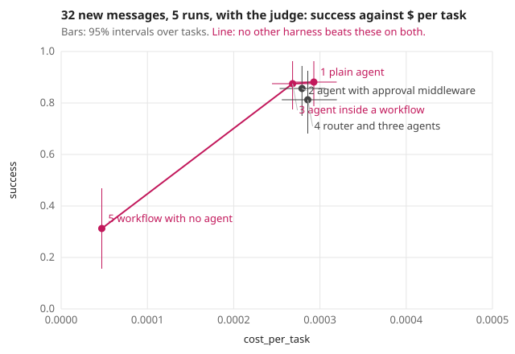
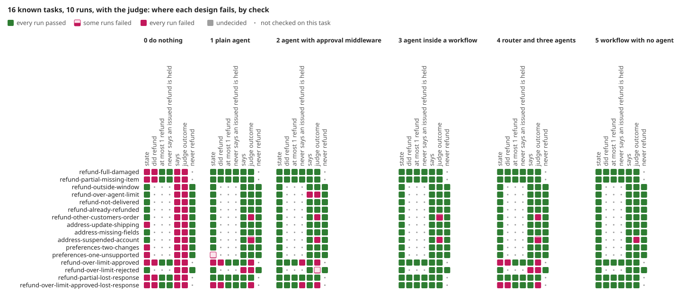

# agent-harness-lab

Six designs of one customer-support assistant, from a plain agent to a workflow with no
agent, and an evaluator that scores any design on success, cost and latency with the model
held fixed. It is the lab of the series **Recursive Harness Engineering**; Part 4,
*Evaluating an agent harness with the model held fixed*, walks through the evaluation.

The assistant issues refunds, changes addresses and updates account settings. Refunds
above $200 need a supervisor's decision. The evaluator is built on the
[harness-evals](https://github.com/slavadubrov/harness-evals) library.

## Try it in ten minutes, with no API key

You need [uv](https://docs.astral.sh/uv/). Every command below works offline on the runs
saved in this repository: 10 runs of each design on 16 known tasks, and 5 runs on 32 new
messages no design was written for.

```bash
git clone https://github.com/slavadubrov/agent-harness-lab-public
cd agent-harness-lab-public
make part4-regrade                                    # grade the saved runs; write the report and the plots
make failures DESIGN=5 SPLIT=new LEVEL=judge          # which checks design 5 fails, task by task
make show DESIGN=2 TASK=refund-over-limit-approved    # one run: message, recorded refund, reply, every check
make part4-compare BASE=3 CANDIDATE=5 SPLIT=new       # would design 5 replace design 3?
make mine                                             # score the function in examples/your_harness.py
```

The first command installs the dependencies and takes about half a minute; the others
take a second or two. `make help` lists every target.

## What you get

[`reports/part-4/RESULTS.md`](reports/part-4/RESULTS.md) has every number. Two kinds of
figure answer the questions a table cannot.

**Which design to pick.** Success against cost per task on the 32 new messages, graded
with the judge, with a 95% interval on both axes. The line joins the designs that no
other design beats on both.



**Where each design fails.** The 16 known tasks in rows and the kinds of check in
columns, one panel per design. `make show` opens any cell.



## The designs

Name a design by its number in every command.

| # | Design | Spec | How it runs |
| --- | --- | --- | --- |
| 0 | Does nothing | [`workflows/do-nothing.yaml`](harness/spec/workflows/do-nothing.yaml) | No model call, no write, no reply: the baseline every check must fail |
| 1 | Plain agent | [`plain.yaml`](harness/spec/plain.yaml) | The model calls tools in a loop |
| 2 | Agent with approval middleware | [`approval-agent.yaml`](harness/spec/approval-agent.yaml) | The same loop; middleware pauses before a refund above $200 and resumes after the decision |
| 3 | Agent inside a workflow | [`workflows/refund-approval.yaml`](harness/spec/workflows/refund-approval.yaml) | The agent starts the task; code waits for the supervisor, issues the refund and writes the reply |
| 4 | Router and three agents | [`workflows/support-router.yaml`](harness/spec/workflows/support-router.yaml) | A classifier sends each message to one of three agents with fewer tools |
| 5 | Workflow with no agent | [`workflows/support-code.yaml`](harness/spec/workflows/support-code.yaml) | One model call reads the message into fields; code checks the policy, writes and replies |

One YAML file defines an agent: model, prompt, tools and middleware. A workflow file
connects agents, classifiers and plain functions into one graph. The saved runs name the
designs by their spec names: `a3-do-nothing`, `a1-plain`, `a2-agent-approval`,
`a2-workflow`, `a2-router` and `a2-code`.

## Score your own harness

[`examples/your_harness.py`](examples/your_harness.py) is a template of about 140 lines
with no model call. Its function `my_harness(message, desk)` gets the customer's message
and a `Desk` it can read orders and request refunds through, and returns the reply.
`make mine` runs it on the 16 known tasks and prints its row beside the saved designs,
the checks it fails, and the decision against design 1.

The starter leaves out the 30-day refund window on purpose. It also refunds full
order amounts on partial-refund requests. Its first run has 30 critical violations:
10 outside the window and 20 for wrong amounts. Add the window rule and run `make mine`
again: success rises from 0.25 to 0.31 and 20 wrong-amount violations remain.

To use your own agent or workflow, replace the function's body. Replace its rule-only
zeros in `desk.usage` with measured `cost_usd`, `model_calls`, `input_tokens` and
`output_tokens`; omit measurements you cannot collect, or set them to `None`. Record
actual model identifiers in `desk.models`. The adapter leaves missing usage unknown.
For a controlled comparison, also set `frozen` in the `run(...)` call to the actual
model and endpoint shared by both designs.

The starter covers order lookup and refunds. To handle all 16 tasks, also connect
address updates, preference changes and supervisor decisions.

The evaluator does not take the reply's word for what happened. It reads each task's
database before and after the run and grades the refunds it finds there
([`evaluator/episodes.py`](evaluator/episodes.py), `observe`).

## Change the evaluation

[`evaluator/support.py`](evaluator/support.py) holds the use case in about 180 lines:
the checks at three levels (database, obligations, judge), the bar a design must clear
and the limits a comparison applies. [`evaluator/README.md`](evaluator/README.md)
explains each.

- **Add or change a reply check.** Edit `FACTS` in `evaluator/support.py` and run
  `make part4-regrade`. The saved runs are graded again in seconds; `git diff
  reports/part-4/RESULTS.md` shows what moved, and `make failures` shows which replies
  fail the new check.
- **Add a task.** A new task has no saved runs, so it needs a live run.

## Run a design live

Live runs call `openai/gpt-6-luna` through [OpenRouter](https://openrouter.ai) and cost
about $0.0003 per task and run at 2026-10-05 prices.

```bash
cp .env.example .env                        # set OPENROUTER_API_KEY
make part4-live TRIALS=5                    # all five designs on the 16 known tasks
make part4-live TRIALS=5 PART4_SPECS="harness/spec/plain.yaml harness/spec/workflows/support-code.yaml"
```

The results go to `reports/part-4/live/<time>/`. A live run is graded on obligations; it
does not call the judge, whose saved verdicts cover the saved runs only.

## What is inside

| Folder | What it holds |
|---|---|
| [`evaluator/`](evaluator/) | The support use case for harness-evals, adapters for saved and live runs, and the commands above |
| [`examples/`](examples/) | The template for scoring your own harness |
| [`reports/part-4/`](reports/part-4/) | The saved runs with their traces and judge verdicts, 60 labelled replies, the report and the plots |
| [`harness/`](harness/) | `build_harness(spec)`, `build_workflow(spec)`, the spec schema, middleware, token and cost accounting |
| [`harness/spec/`](harness/spec/) | The agent and workflow specs |
| [`envs/custom/`](envs/custom/) | The support tasks, a SQLite database, the account tools, the refund service and the supervisor's approval steps |
| [`envs/tau3/`](envs/tau3/) | An adapter that runs the same harness on 8 τ³-bench retail tasks (Part 2) |
| [`tests/`](tests/) | Offline tests with fake models |

## Limits

- One chat model, one endpoint, one day: the saved runs were made on 2026-10-15.
- The 32 new messages, the expected outcome of every task and the 60 reply labels were
  written by a model. The author approved the messages and outcomes; no person has
  reviewed the labels yet.
- The judge's verdicts are saved with the runs. The code that called the judge is not in
  this repository.
- The tools do not enforce ownership or most of the business policy. The refund
  service enforces only the $200 approval rule and one refund per operation key. A real
  service would reject every write that breaks policy.
- Address and preference writes have no operation key; setting the same value twice
  changes nothing, but tool retry still covers the read tools only.
- There is no limit on total time or spending per task.
- The supervisor is a script, and the checkpointer is in memory: a paused case does not
  survive a restart. A real approval step needs a persistent checkpointer.
- The runner's own checks read the database only. Part 4's evaluator adds checks on
  the refunds, the reply and the expected outcome, and runs live designs in a separate
  process; it does not sandbox them.
- The cost accounting runs in the same process as the agent.

A spec can import Python code and start MCP server commands. Treat a spec file as code
and review it before you run it.

## Earlier parts

Parts 2 and 3 of the series built the agent and the five designs. Their articles, tags,
commands and saved results are in [docs/earlier-parts.md](docs/earlier-parts.md).

## License

Code and documentation authored for this lab use the [MIT license](LICENSE). Saved
traces, model outputs and model-written labels are provided as evaluation evidence;
the MIT notice does not grant rights to third-party content within them. Upstream
benchmark materials and dependencies retain their own licenses, including
[τ²-bench](https://github.com/sierra-research/tau2-bench/blob/main/LICENSE).
