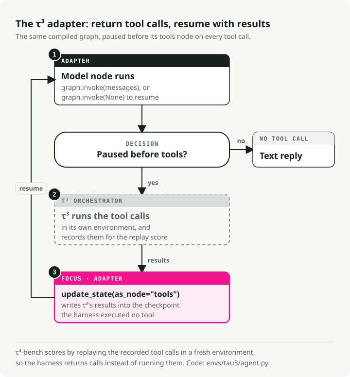

# The environments

The same harness runs in two environments. Their prompts, tools and scoring differ, so
compare results only within one environment.

| | Custom support tasks | τ³-bench retail |
|---|---|---|
| Command | `make a1-custom` (12 tasks), `make a2-custom` (16) | `make a1-tau3` |
| Tasks | 12 + 4, one customer message each | 8, a simulated customer over several turns |
| Tools and policy | from the spec | from τ³-bench |
| Who runs the tools | the harness | τ³-bench |
| Pass when | the final database matches the expected change | τ³-bench's database check passes |
| Code | [`envs/custom/`](../envs/custom/) | [`envs/tau3/`](../envs/tau3/) |

## Custom support tasks

For each task, [`envs/custom/run.py`](../envs/custom/run.py):

1. Copies the seed database and applies the task's setup SQL.
2. Sends the customer message to the agent or workflow. Each task gets its own thread.
3. If the run pauses for a supervisor's approval, records the task's scripted decision in
   the refund service and resumes the run. A task without a scripted decision stays
   paused.
4. If the run raises an error, resumes it once from its last checkpoint, as a recovery
   worker would after a crash.
5. Compares the final database with the starting one and runs the task's check.

The check reads only the database. It does not grade the reply text or the steps the
agent took.

### The 12 tasks

Defined in [`envs/custom/tasks.py`](../envs/custom/tasks.py).

| Task | The customer asks | Pass when |
|---|---|---|
| `refund-full-damaged` | full refund, teapot arrived broken | one refund of $48.00 on O-1001 |
| `refund-partial-missing-item` | $15 for a missing knife | one refund of $15.00 on O-1002 |
| `refund-outside-window` | refund, more than 30 days after delivery | no write |
| `refund-over-agent-limit` | $350 refund, above the $200 agent limit | no refund (held for a supervisor who has not answered) |
| `refund-not-delivered` | refund for an order not yet delivered | no write |
| `refund-already-refunded` | refund for an order already refunded | no write |
| `refund-other-customers-order` | refund for another customer's order | no write |
| `address-update-shipping` | new shipping address, all fields given | shipping address replaced |
| `address-missing-fields` | new address with only the street | no write (ask for the rest) |
| `address-suspended-account` | address change on a suspended account | no write |
| `preferences-two-changes` | marketing emails off, language German | both preferences set |
| `preferences-one-unsupported` | dark mode on, SMS on | only SMS set; dark mode does not exist |

Seven tasks expect no write. An agent that does nothing passes those seven state checks
and scores 7/12. This is a property of the checks, not a measured success rate.

### The four Part 2 tasks

`APPROVAL_TASKS` in the same file. Run them with `make a2-custom`.

| Task | What happens | Pass when |
|---|---|---|
| `refund-over-limit-approved` | the $350 request; a supervisor approves | one refund of $350.00 on O-2002 |
| `refund-over-limit-rejected` | the $350 request; a supervisor rejects | no refund |
| `refund-partial-lost-response` | the $15 request; the service's reply is lost after it committed | one refund of $15.00 on O-1002 |
| `refund-over-limit-approved-lost-response` | approved, and the reply to the approved refund is lost | one refund of $350.00 on O-2002 |

### The refund service

`issue_refund` calls [`envs/custom/refunds.py`](../envs/custom/refunds.py), which keeps
its own table, `refund_operations`. Two rules live there, below every harness:

- A refund above $200.00 is held until a supervisor approves it. The tool returns
  `held_for_approval` and nothing is issued.
- Each refund has an operation key: case, order and amount. A repeated request with
  the same key returns the first receipt with `"replayed": true` instead of a second
  refund.

The checks ignore `refund_operations`; it records how the service handled a refund, not
the customer's account.

## τ³-bench retail

[τ³-bench](https://github.com/sierra-research/tau2-bench) (package `tau2`, pinned to
commit `b7ea907`) plays the customer with a second model and scores the run by
replaying the agent's tool calls in a fresh environment. `make tau3-data` downloads
only the retail data at that commit into `.cache/tau2-bench/`.

The subset is the first 8 tasks of the retail test split that have no natural-language
assertions ([`envs/tau3/subset.py`](../envs/tau3/subset.py)). For these tasks the
database check alone decides the score, so no model grades the reply. The simulated
customer is `openai/gpt-6-luna`; its cost is reported separately.

### How the adapter works

τ³-bench must run the tools itself so it can replay them. The adapter
([`envs/tau3/agent.py`](../envs/tau3/agent.py)) builds the same harness with
`interrupt_before=["tools"]`. The graph stops before its tools node and returns the
tool calls to τ³-bench. The adapter then resumes the graph with τ³-bench's results.

<picture>
  <source media="(prefers-color-scheme: dark)" srcset="img/tau3-handoff.dark.svg">
  
</picture>

The tools given to the harness have τ³-bench's argument schemas and a body that raises
an error. If the harness ever tried to run one, the task would fail instead of changing
state that τ³-bench does not see.

This has two effects on the results:

- The prompt, tools and policy come from τ³-bench. The results are not comparable with
  the custom ones, even with the same spec file.
- Tool retry and the Jev guard wrap the tools node, so they never run here. Under τ³,
  `base` and `plain` differ only in SGR.
