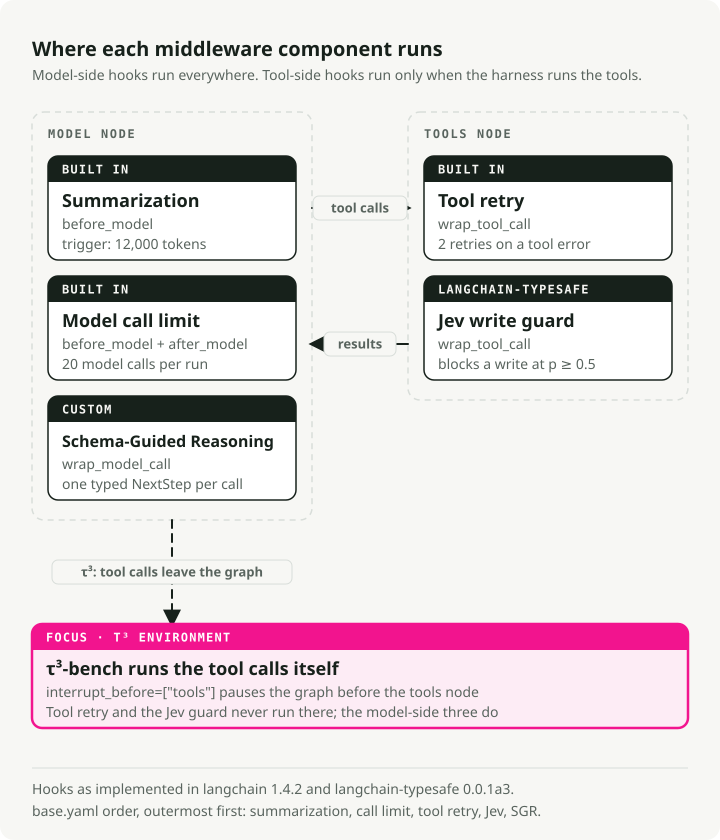

# How the harness works

This page explains how a spec file becomes an agent, where each middleware component
runs, and what a run records. For the task environments, see
[environments.md](environments.md). For the spec format, see [specs.md](specs.md).

## From spec to agent

`build_harness(spec)` in [`harness/agent.py`](../harness/agent.py) reads a validated
spec and calls LangChain's `create_agent` once:

```python
create_agent(
    model,  # ChatOpenRouter, pinned to one endpoint
    tools,  # @tool functions + MCP tools, after include/exclude
    system_prompt=...,
    middleware=[...],  # in spec order, outermost first
    context_schema=...,  # AccountContext: the database path for this task
    checkpointer=InMemorySaver(),
)
```

The spec is the only input that changes the harness. An environment can pass one more
object, `EnvBinding`, but only to supply its own tools and policy text. τ³-bench uses it
because it builds a fresh tool set for each task. `EnvBinding` cannot change the model,
prompt or middleware.

## The model

The model is `openai/gpt-6-luna` through OpenRouter. The spec pins one provider
endpoint (`settings.provider.order` with `allow_fallbacks: false`), so the price per
token stays fixed for the whole run. Both runners stop with an error if an OpenRouter
model has no pinned endpoint (`model_price` in `harness/agent.py`).

## The tools

| Tool | Reads or writes | Source |
|---|---|---|
| `look_up_account` | reads | [`envs/custom/tools.py`](../envs/custom/tools.py) |
| `list_orders` | reads | same |
| `issue_refund` | writes | same |
| `update_address` | writes | same |
| `set_preference` | writes | same |
| `lookup_policy`, `search_faq` | reads | MCP server over stdio, [`envs/custom/policy_mcp.py`](../envs/custom/policy_mcp.py) |

The write tools check that the order or account exists and that a refund does not
exceed what is left on the order. They do not check ownership, refund windows or account
status. The agent must read the policy and apply it. The tasks measure whether it does.
`issue_refund` goes through the refund service, which holds refunds above $200 for a
supervisor and issues each refund once ([environments.md](environments.md#the-refund-service)).

## Where each middleware component runs

<picture>
  <source media="(prefers-color-scheme: dark)" srcset="img/middleware-hooks.dark.svg">
  
</picture>

| Component | Hook | Setting in `base.yaml` |
|---|---|---|
| Summarization | before each model call | summarize above 12,000 tokens, keep the last 20 messages |
| Model call limit | before and after each model call | 20 calls per run, then end the run |
| Tool retry | around each tool call | 2 retries on a tool error, for the four read tools only |
| Jev write guard | around each write tool call | block the call when Jev returns p ≥ 0.5 |
| Schema-Guided Reasoning | around each model call | one typed `NextStep` per call |

`plain.yaml` keeps the first three and drops Jev and SGR.

## Schema-Guided Reasoning (SGR)

Code: [`harness/sgr.py`](../harness/sgr.py).

Without SGR, the model answers with native tool calls. With SGR, every model call must
return one `NextStep` object. Its fields come in a fixed order:

```
current_state → policy_check → missing_information → plan_remaining_steps → action
```

`action` is one of:

- `Call_<tool>`: one tool call, with that tool's own argument schema.
- `ReplyToUser`: one message to the customer, which ends the run.

The middleware turns the `NextStep` into a normal LangChain message, so the agent loop,
checkpointer and other middleware stay unchanged. The parsed object is saved in the
trace but is not sent back to the model.

If the model returns an invalid object, the middleware calls the model once more
(`max_parse_retries: 1`). A second failure raises `SGRParseError` and the task fails.
The model call limit counts model steps, not these retries, so one step can make two
model calls.
All five MiMo failures in the saved runs are this error.

## The Jev write guard

Code: [`harness/typesafe_guard.py`](../harness/typesafe_guard.py).

Before `issue_refund`, `update_address` or `set_preference` runs, the guard sends the
conversation and the proposed call to TypeSafe Jev. It asks one yes/no question: would
this call break the policy or go beyond what the customer asked for? Jev returns a
probability.

- p < 0.5: the tool runs.
- p ≥ 0.5: the tool does not run. The model gets an error message instead and can try
  something else.

The guard calls Jev through OpenRouter's Decisions API, so the OpenRouter key is the
only key you need. The exact question is in
[`base.yaml`](../harness/spec/base.yaml) under `TypeSafeAutoMode`.

In the saved runs, Jev allowed every write it checked. These runs do not show whether
it blocks a bad write.

## What a run records

Each run writes three files to `reports/article-a1/<env>/<spec>/`:

| File | Contents |
|---|---|
| `results.jsonl` | One row per task: pass/fail, reason, tokens, dollars, latency, call counts |
| `traces.jsonl` | Every message, model call and tool call, failed runs included |
| `run.json` | The full spec, prices, package versions and git commit |

Token counts come from the provider's reported usage, not from an estimate. Dollars are
tokens × the price of the pinned endpoint, Jev calls included. OpenRouter's own billed
cost for each chat call is saved next to it as a check.

[`scripts/report_a1.py`](../scripts/report_a1.py) reads these files and rebuilds
[`reports/article-a1/README.md`](../reports/article-a1/README.md). Run it alone with
`make report`.

## Limits

- The accounting runs as a LangChain callback inside the agent process. A later
  article moves the evaluator out of that process
  ([`evaluator/`](../evaluator/README.md) is empty until then).
- No limit on total time or spending per task.
- Writes have no idempotency key, so retrying a write that raised after it committed would run it twice. Tool retry is therefore limited to `look_up_account`, `list_orders`, `lookup_policy` and `search_faq`. A write that raises is not retried: LangGraph's default tool node re-raises the exception, and the run ends with the error recorded. Rejections such as "No order" are returned values, not exceptions, so they still reach the model.
