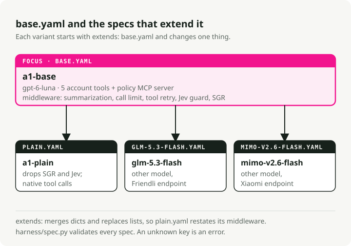

# Writing a spec

A spec is one YAML file that defines the whole harness: model, system prompt, tools,
middleware and checkpointer. `build_harness` reads nothing else. For how the spec
becomes an agent, see [how-it-works.md](how-it-works.md).

<picture>
  <source media="(prefers-color-scheme: dark)" srcset="img/spec-family.dark.svg">
  
</picture>

## Rules

- [`harness/spec.py`](../harness/spec.py) validates every spec. An unknown key is an
  error, so a typo in a top-level or middleware key fails at load time.
- `extends: other.yaml` loads another spec first, relative to this file. Dicts merge
  key by key. Lists replace the parent's list completely.
- Code references use `package.module:attribute`.
- Free-form fields (`model.settings.provider`, `kwargs`) are not checked, so a typo
  inside them is not caught.

## A small variant

```yaml
extends: base.yaml
name: my-variant
model:
  id: z-ai/glm-5.3-flash
  settings:
    provider: {order: [friendli], allow_fallbacks: false}
tools:
  exclude: [set_preference]
```

Run it:

```bash
make a1-custom SPEC=harness/spec/my-variant.yaml
```

Results go to `reports/article-a1/custom/my-variant/`.

## Top-level keys

| Key | What it sets |
|---|---|
| `name` | Run name, also the report folder name |
| `model` | `id` and `settings` for an OpenRouter model, or `provider: import` with a `ref` to any LangChain chat model class |
| `system_prompt` | The system prompt |
| `tools` | Tool sources, `include` / `exclude` lists, and the runtime context schema |
| `middleware` | Middleware list. The first entry is the outermost wrapper |
| `checkpointer` | `memory` or `none` |

An OpenRouter model must pin one endpoint in `settings.provider.order`, so the price is
fixed. Calls to an imported model are reported as unpriced.

## Tool sources

| Key | Accepts |
|---|---|
| `functions` | Import paths to `@tool` functions or lists of them, for example `envs.custom.tools:TOOLS` |
| `mcp_servers` | MCP servers by name: `stdio` with `command` and `args`, or `streamable_http`, `sse`, `websocket` with `url` |
| `sources` | `{type: import, ref}`, `{type: factory, ref, kwargs}` for classes such as LangChain toolkits, `{type: provider, spec}` for a provider's built-in tool |

A tool package that is not installed needs `uv add <package>` first. Example:

```yaml
tools:
  sources:
    - {type: factory, ref: langchain_tavily:TavilySearch, kwargs: {max_results: 3}}
```

## Middleware entries

| `type` | Component |
|---|---|
| `SummarizationMiddleware` | LangChain summarization |
| `ModelCallLimitMiddleware` | LangChain model call limit |
| `ToolRetryMiddleware` | LangChain tool retry. `tools: [names]` limits it to those tools; omit it to retry every tool |
| `SchemaGuidedReasoning` | SGR, [`harness/sgr.py`](../harness/sgr.py) |
| `TypeSafeAutoMode` | Jev write guard, [`harness/typesafe_guard.py`](../harness/typesafe_guard.py) |
| `import` | Any other `AgentMiddleware`: `{type: import, ref, kwargs}` |

`ToolCallLimitMiddleware` has no typed entry. Use `import` with
`ref: langchain.agents.middleware:ToolCallLimitMiddleware` and kwargs such as `tool_name`,
`thread_limit`, `run_limit` and `exit_behavior`. No A1 spec uses it.

For `import`, a kwargs value of `"$harness_model"` is replaced with the harness chat
model, for middleware that needs one.

## Safety

A spec can import any Python code and start any MCP server command. Load only specs you
trust. Do not put secrets in a spec: `run.json` stores the full spec with the results.

## Workflow specs

A workflow spec (`kind: workflow`) connects several nodes into one LangGraph graph:
agents, structured-output calls, classifiers, tools, functions and other workflows.
`build_workflow(spec)` in [`harness/workflow.py`](../harness/workflow.py) compiles it.

| Workflow | What it does |
|---|---|
| [`refund-approval.yaml`](../harness/spec/workflows/refund-approval.yaml) | Runs the plain agent, then finds refunds the service holds, pauses for a supervisor, issues the approved refund and writes the reply in code |
| [`support-router.yaml`](../harness/spec/workflows/support-router.yaml) | A Jev classifier sends the request to one of three plain agents with smaller tool sets |
| [`support-router-clarify.yaml`](../harness/spec/workflows/support-router-clarify.yaml) | The same router with a fourth route that asks the customer to clarify |

`envs.custom.run` runs agent and workflow specs the same way (`make a2-custom SPEC=...`).

Node settings beyond the type's own fields:

- `retry` on a function node sets a LangGraph `RetryPolicy`: `max_attempts`,
  `initial_interval` and `retry_on`, a list of exception classes as import paths
  (`builtins:ConnectionError`). Retry only a node whose writes are safe to repeat.
- `probabilities_output` on a classifier node stores Jev's full distribution next to
  the chosen label and its confidence.

An agent node runs a whole `create_agent` inside the node. If the workflow retries or
resumes that node while the agent's own checkpoint shows unfinished work, the node
continues the agent's run instead of sending the message again.
